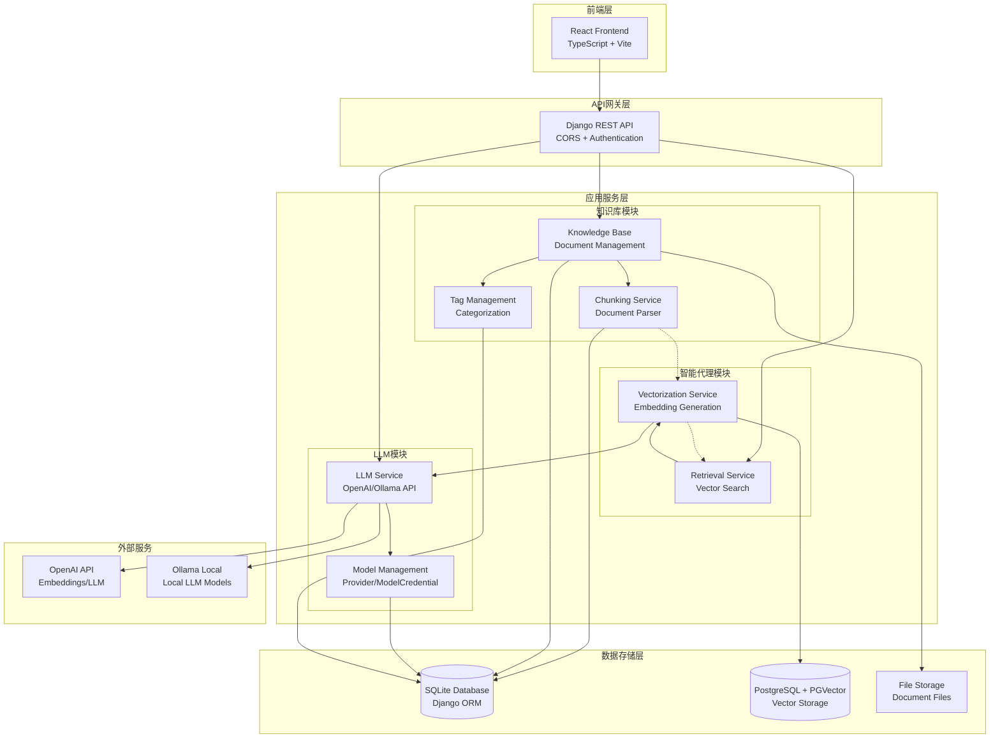
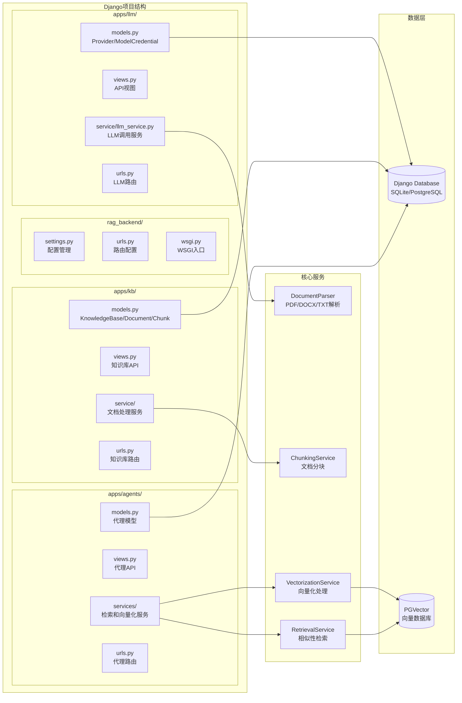
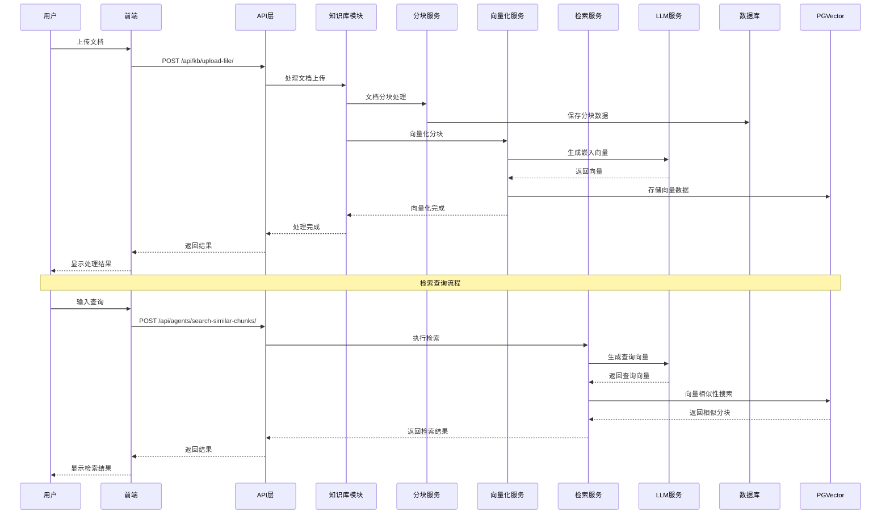
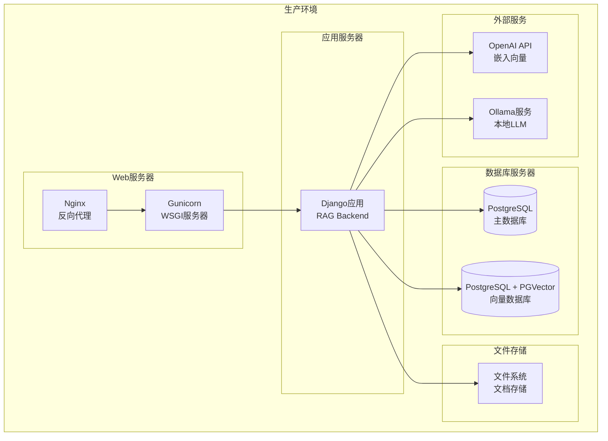
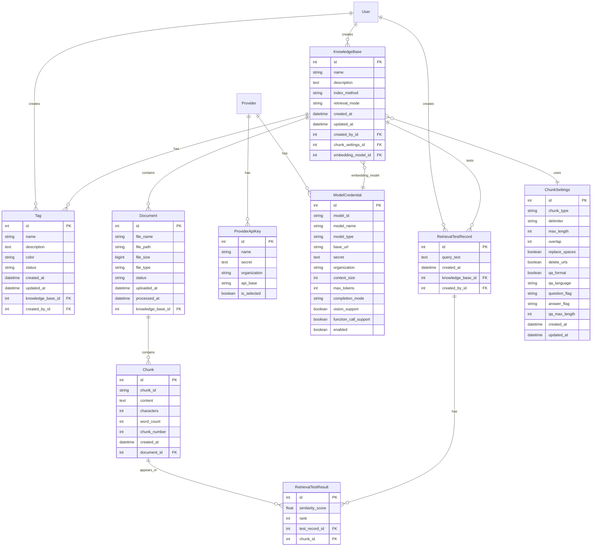

# RAG 后端架构图

## 系统架构概览

## 详细模块架构

## 数据流架构

## 技术栈详情

### 后端框架
- **Django 5.2.7** - Web框架
- **Django REST Framework** - API框架
- **Django CORS Headers** - 跨域处理

### 数据库
- **SQLite/PostgreSQL** - 主数据库（Django ORM）
- **PostgreSQL + PGVector** - 向量数据库

### 外部服务
- **OpenAI API** - 嵌入向量生成
- **Ollama** - 本地LLM服务

### 文档处理
- **python-docx** - DOCX文件解析
- **PyPDF2** - PDF文件解析
- **pandas** - CSV文件处理

### 向量处理
- **numpy** - 数值计算
- **psycopg2** - PostgreSQL连接
- **aiohttp** - 异步HTTP请求

## 核心功能模块

### 1. LLM模块 (apps/llm)
- **Provider管理**: 支持多个LLM提供商
- **模型配置**: 管理不同模型的凭据和参数
- **API调用**: 统一的LLM和嵌入向量API调用接口

### 2. 知识库模块 (apps/kb)
- **文档管理**: 上传、存储、管理各种格式文档
- **分块处理**: 智能文档分块，支持Q&A格式
- **标签系统**: 知识库分类和标签管理
- **检索测试**: 检索效果测试和记录

### 3. 智能代理模块 (apps/agents)
- **向量化服务**: 将文档分块转换为向量
- **检索服务**: 基于向量相似性的智能检索
- **相似性搜索**: 使用PGVector进行高效向量搜索

## 部署架构

## 数据库设计架构

### 核心数据模型

### 数据库表结构详情

#### 1. LLM模块表 (apps_llm)

**Provider表** - LLM提供商管理
- `id`: 主键
- `slug`: 唯一标识符 (如: openai, ollama)
- `display_name`: 显示名称
- `enabled`: 是否启用

**ProviderApiKey表** - API密钥管理
- `id`: 主键
- `provider_id`: 外键关联Provider
- `name`: 密钥别名
- `secret`: 加密存储的API密钥
- `organization`: 组织标识
- `api_base`: 自定义API基础URL
- `is_selected`: 是否为当前选中的密钥

**ModelCredential表** - 模型凭据配置
- `id`: 主键
- `provider_id`: 外键关联Provider
- `model_id`: 模型标识符
- `model_name`: 模型显示名称
- `model_type`: 模型类型 (LLM, TEXT_EMBEDDING)
- `base_url`: 模型专用基础URL
- `secret`: 模型专用密钥
- `organization`: 组织标识
- `context_size`: 上下文长度
- `max_tokens`: 最大输出token数
- `completion_mode`: 完成模式 (Chat/Completion)
- `vision_support`: 是否支持视觉
- `function_call_support`: 是否支持函数调用
- `enabled`: 是否启用

#### 2. 知识库模块表 (apps_kb)

**ChunkSettings表** - 分块配置
- `id`: 主键
- `chunk_type`: 分块类型 (general/qa)
- `delimiter`: 分隔符
- `max_length`: 最大长度
- `overlap`: 重叠长度
- `replace_spaces`: 是否替换空格
- `delete_urls`: 是否删除URL
- `qa_format`: Q&A格式开关
- `qa_language`: Q&A语言
- `question_flag`: 问题标识符
- `answer_flag`: 答案标识符
- `qa_max_length`: Q&A最大长度

**KnowledgeBase表** - 知识库
- `id`: 主键
- `name`: 知识库名称
- `description`: 描述
- `index_method`: 索引方法 (hq/eco)
- `retrieval_mode`: 检索模式 (vector/fulltext/hybrid)
- `created_at`: 创建时间
- `updated_at`: 更新时间
- `created_by_id`: 创建者外键
- `chunk_settings_id`: 分块设置外键
- `embedding_model_id`: 嵌入模型外键

**Document表** - 文档
- `id`: 主键
- `knowledge_base_id`: 知识库外键
- `file_name`: 文件名
- `file_path`: 文件路径
- `file_size`: 文件大小
- `file_type`: 文件类型
- `status`: 处理状态 (uploaded/processing/completed/failed)
- `uploaded_at`: 上传时间
- `processed_at`: 处理完成时间

**Chunk表** - 文档分块
- `id`: 主键
- `document_id`: 文档外键
- `chunk_id`: 分块唯一标识
- `content`: 分块内容
- `characters`: 字符数
- `word_count`: 词数
- `chunk_number`: 分块序号
- `created_at`: 创建时间

**Tag表** - 标签
- `id`: 主键
- `knowledge_base_id`: 知识库外键
- `name`: 标签名称
- `description`: 标签描述
- `color`: 标签颜色
- `status`: 标签状态 (active/inactive)
- `created_at`: 创建时间
- `updated_at`: 更新时间
- `created_by_id`: 创建者外键

**RetrievalTestRecord表** - 检索测试记录
- `id`: 主键
- `knowledge_base_id`: 知识库外键
- `query_text`: 查询文本
- `created_at`: 创建时间
- `created_by_id`: 创建者外键

**RetrievalTestResult表** - 检索测试结果
- `id`: 主键
- `test_record_id`: 测试记录外键
- `chunk_id`: 分块外键
- `similarity_score`: 相似度分数
- `rank`: 排名

### 数据库关系说明

1. **一对多关系**:
   - User → KnowledgeBase (一个用户可创建多个知识库)
   - KnowledgeBase → Document (一个知识库包含多个文档)
   - Document → Chunk (一个文档包含多个分块)
   - KnowledgeBase → Tag (一个知识库有多个标签)
   - KnowledgeBase → RetrievalTestRecord (一个知识库有多个测试记录)

2. **多对多关系**:
   - 通过外键实现，如Chunk与RetrievalTestResult的关系

3. **外键约束**:
   - 所有外键都设置了适当的级联删除策略
   - 用户相关数据在用户删除时级联删除
   - 知识库相关数据在知识库删除时级联删除

### 索引策略

1. **主键索引**: 所有表都有自增主键
2. **外键索引**: 所有外键字段自动创建索引
3. **唯一约束**: 
   - Provider.slug
   - ProviderApiKey (provider, name)
   - ModelCredential (provider, model_id)
   - Tag (name, knowledge_base)
4. **复合索引**: 根据查询模式创建复合索引

### 数据存储策略

1. **SQLite/PostgreSQL**: 存储结构化数据
2. **PGVector**: 存储向量嵌入数据
3. **文件系统**: 存储原始文档文件
4. **加密存储**: API密钥等敏感信息加密存储

这个架构图展示了您的RAG后端系统的完整结构，包括各个模块之间的关系、数据流向以及技术栈组成。
